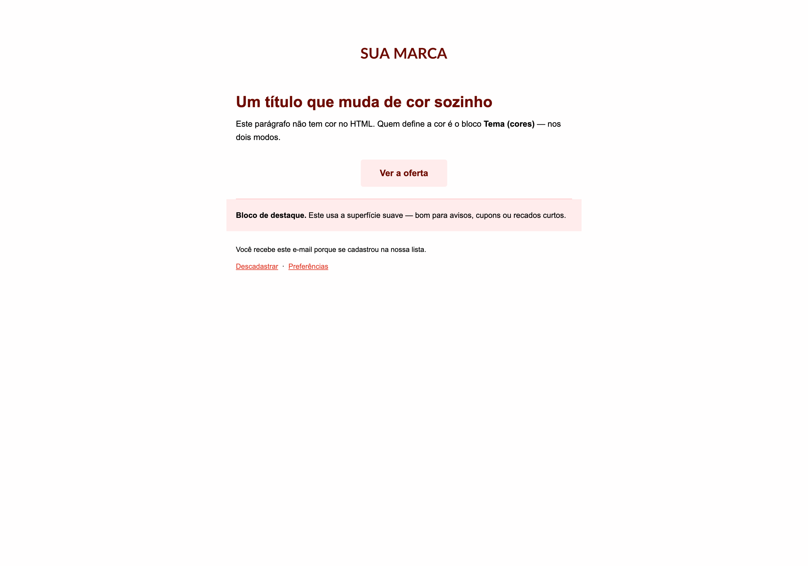
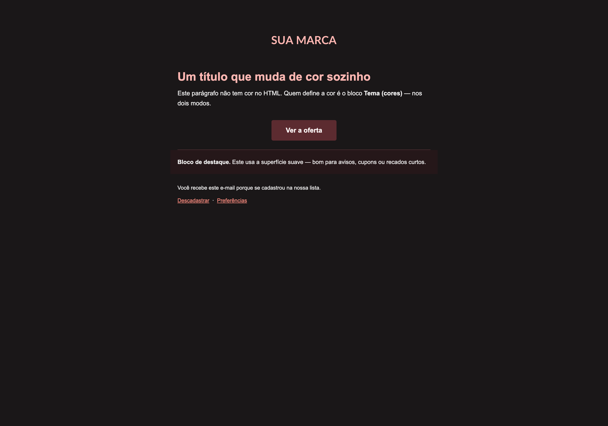
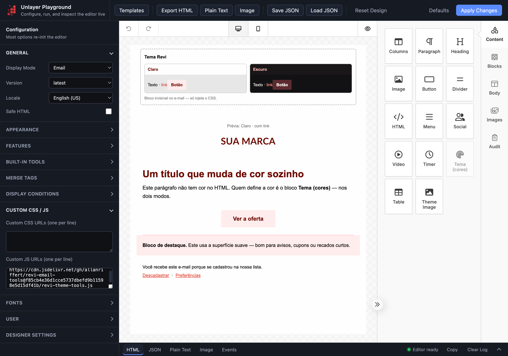
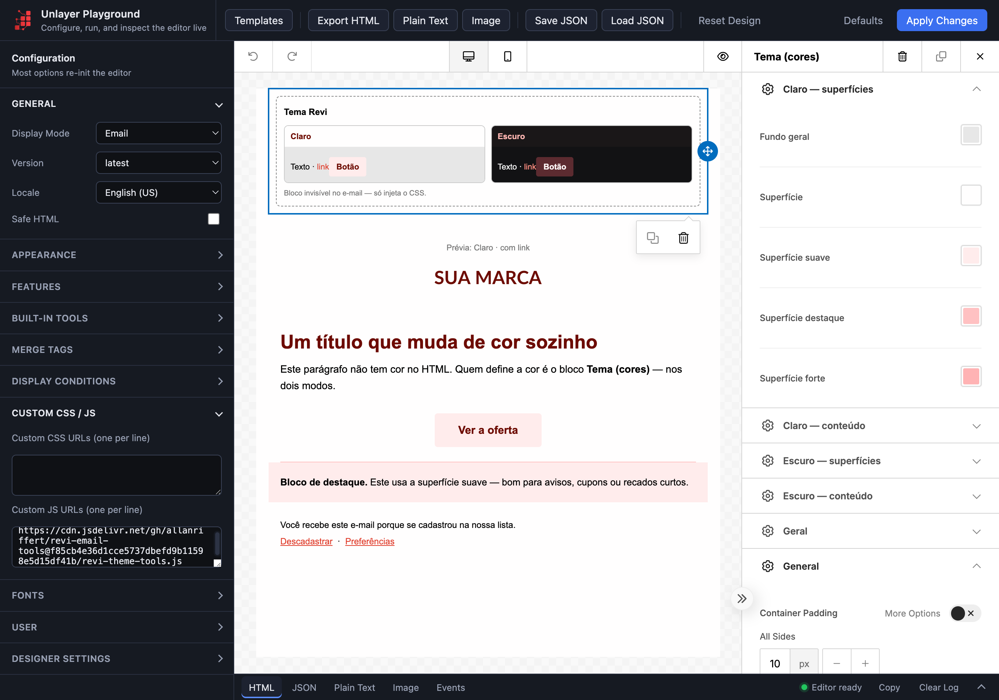

# revi-email-tools

Custom tools de dark mode para o editor de e-mail **Unlayer**.

Dois blocos: um define a paleta clara e escura do template, outro troca a imagem
conforme o modo. As cores ficam no design — não no código.

| | |
|---|---|
|  |  |

---

# Para o dev — instalação

## 1. Carregue o script

```js
unlayer.init({
  id: 'editor',
  displayMode: 'email',
  customJS: [
    'https://cdn.jsdelivr.net/gh/allanriffert/revi-email-tools@main/revi-theme-tools.js'
  ]
});
```

Para não depender de cache, fixe um commit no lugar de `@main`:
`@<sha>/revi-theme-tools.js`.

## 2. Carregue o template base

```js
fetch('https://cdn.jsdelivr.net/gh/allanriffert/revi-email-tools@main/template-base.json')
  .then(r => r.json())
  .then(design => unlayer.loadDesign(design));
```

Feito isso, os blocos aparecem na paleta e o template abre pronto:



## 3. Se for montar o design por JSON

Os blocos custom usam `type: "custom"` + `slug`:

```json
{ "type": "custom", "slug": "revi_theme", "values": { ... } }
```

Usar o nome do tool direto em `type` faz o Unlayer renderizar o bloco como
**"Missing"** e o CSS não é injetado — sem erro no console.

---

# Para quem monta o e-mail

## 1. Bloco "Tema (cores)"

Um por template. É ele que injeta o CSS — sem ele nada muda de cor.
Não aparece no e-mail, só no editor.

12 cores para o modo claro e 12 para o escuro, em quatro seções.
A prévia no bloco mostra os dois lados:



Em "Geral" há o toggle **Aplicar modo escuro**, para desligar o escuro no template.

## 2. Bloco "Theme Image"

Uma arte para cada modo. As duas vão no HTML; o CSS decide qual aparece.
Em **Ação**, um link opcional torna a imagem clicável.


## 3. Marque os blocos

O tema só age em blocos marcados. No painel do bloco, em **CSS class names**,
use as classes abaixo.

| classe | efeito |
|---|---|
| `revi-dm-bg` | fundo geral + cor do texto |
| `revi-dm-surface` | fundo do bloco |
| `revi-dm-surface-soft` | fundo suave (avisos, cupons) |
| `revi-dm-surface-accent` | fundo de destaque |
| `revi-dm-surface-strong` | fundo forte |
| `revi-dm-heading` | cor de título (h1, h2, h3) |
| `revi-dm-text` | cor do texto (p, span) |
| `revi-dm-menu` | cor dos links de menu |
| `revi-dm-link` | cor dos links |
| `revi-dm-button` | fundo e texto do botão |
| `revi-dm-border-accent` | cor da borda |
| `revi-dm-border-strong` | cor da borda forte |
| `revi-dm-divider` | cor do divisor |

**Toda superfície precisa de uma classe de texto junto.** `revi-dm-surface`
sozinha troca o fundo e deixa o texto na cor original — preto no preto.
Use `revi-dm-surface revi-dm-text`.

**Não defina cor no bloco.** Cor fixa no HTML vence no modo claro e briga com o tema.
Deixe a cor para o bloco Tema.

## 4. Confira no e-mail exportado, não no editor

O editor não renderiza o `<body>` do e-mail, então o fundo aparece cinza no canvas
mesmo estando correto. Use **Export HTML** e abra o arquivo alternando o modo do sistema.

---

# Limitações

- **Gmail** ignora `prefers-color-scheme` e aplica inversão própria. Não há controle.
- **Outlook**: o fallback `[data-ogsc]` é gerado mas o export do Unlayer o descarta —
  o seletor não casa com nada no HTML e o purge de CSS o remove.
- O Unlayer só mantém no CSS as regras cujas classes aparecem no HTML.

Cobertura real: Apple Mail, iOS Mail e Outlook para Mac, via `prefers-color-scheme`.

---

# Arquivos

| arquivo | o que é |
|---|---|
| `revi-theme-tools.js` | os dois blocos (v2) |
| `template-base.json` | template inicial, pronto para `loadDesign` |
| `exemplo-exportado.html` | e-mail de exemplo já exportado |
| `revi-dark-mode-tools.js` | v1, com a paleta fixa no código |

## v1 → v2

Mesmos nomes de classe, então blocos marcados continuam funcionando. Ao migrar,
**remova as cores fixas dos blocos** — na v1 elas eram necessárias para o modo claro,
na v2 elas atrapalham.

O bloco da v1 (`revi_dark_mode`) não é lido pela v2: troque pelo bloco Tema.
